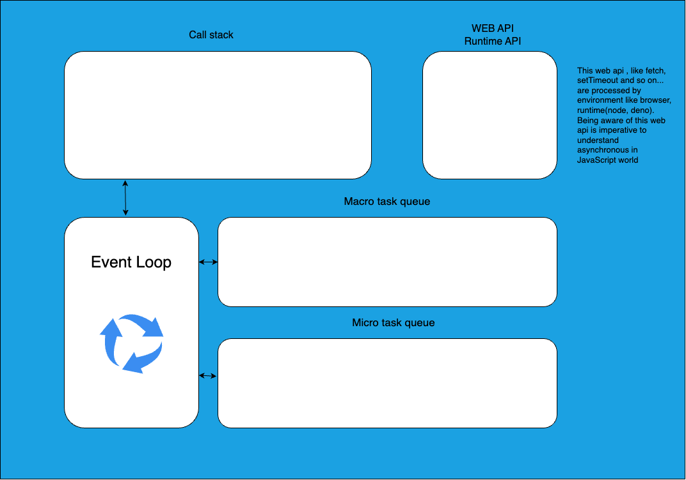

I found a great book to study event loop and promise
https://zenn.dev/estra/books/js-async-promise-chain-event-loop

These knowledge are imperative in the tech interview, and knowing these spec enhances our productivity. So I want to summarize it. 

# Asynchronous api
We should understand what the asynchronous apis are at first. As for setTimeout() and console.log are not defined by ECMA script, but defined by environment like a V8 engine.
For example, comparing Node’s setTimeout() and browser’s setTimeout(), Node’s one is implemented as a copy of browser one, but slightly different according to the node documentation.

# Event loop
Event loop is not defined by ECMA script. So this should be implemented by environment like a browser or runtime( node, demo). There would be able to exist multiple task queue. For example, blink, which is a rendering engine in chrome, prioritize to process click event.


JavaScript is a single thread programming language, and this means, program is executed by single thread and have single call stack.
If RuntimeAPI like fetch() blocks the process, main process would have to wait until fetch() is finished.
So to avoid these situations, Javascript engine doesn’t involve to RuntimeAPI such a fetch(), and when the fetch() gets the data, notice to JavaScript engine with data to register the callback function.

## Task queue
TBD 
Published by setTimeout and so on

## Micro task queue
TBD 
Published by promise. This queue is prioritized to process when one task would be finished(in other words, when call stacks would be empty). Then all micro task queue would be processed.

# About V8 (index of 8)
V8 is a javascript engine provided by Google. This engine is implemented by C++. This has basic default Event loop, task queue, and micro task queue.

# Promise constructor and execute function (index of 12)
This is interesting chapter. 

These statements are nearly equal.
```
const promise1 = Promise.resolve(‘promise履行時の値’);
const promise2 = new Promise(res => res(‘promise履行時の値’);
```

# Issued micro task even if callback isn’t executed(index of 22)
Even if catch and then wouldn’t be executed because above promise is resolved or rejected, these microtask is published.

# Interesting(difficult) event loop question at index24
Just a memo

# The interesting spec of async and await at index26
async function is executed synchronously if there wouldn’t be await statement. This mean async would be ruin if it wouldn’t have await in his process. This effect is written in MDN doc.
As for promise, microtask queue is issued when then method is called. It’s same for await. When calls await, microtask queue is issued (Of course the spec in detail is different, but behavior is like that.)

### Caution
In fact, await doesn’t block the all process.(this is confusion point because of meaning word).as I mentioned above, we can rewrite it using promise chain. Await’s really meaning is “continue another process in main thread!”

# Promise status (index ?)
Knowing the promise status


# Convert from async/await statement to promise chain
https://zenn.dev/estra/books/js-async-promise-chain-event-loop/viewer/14-epasync-chain-to-async-await
As for promise is executed as an asynchronous process when using then method. It is same to async. Async would be asynchronous process when await is used. If there is no await in async, this process is executed same to promise which doesn’t have any then method.
In async function, the execution flows are divided by await statement. Look at this code as below.  
Copied from the above page.

```
(async () => {
  // 分割された実行フロー(0): 同期  → 最初の await までは同期的に処理される
  // <------------------->
  await 1;
  // 分割された実行フロー(1): 非同期 → イベントループでマイクロタスクとして処理される
  // <------------------->
  await 2;
  // 分割された実行フロー(2): 非同期 → イベントループでマイクロタスクとして処理される
  // <------------------->
  await 3;
  // 分割された実行フロー(3): 非同期 → イベントループでマイクロタスクとして処理される
})();
```

We can consider then method is used when await is executed.  
(Copied from the above page.)

```
console.log("🦖 [1] sync");

(async () => {
  console.log("🦄 [2] sync");
  // ここまでは同期処理!!

  // await のたびに then しているのと同じ
  await Promise.resolve(1);
  console.log("👻 [4] async");
  await Promise.resolve(2);
  console.log("👻 [5] async");
})();

console.log("🦖 [3] sync");

/* 出力結果
🦖 [1] sync
🦄 [2] sync
🦖 [3] sync
👻 [4] async
👻 [5] async
*/
```

The above code can be written like this.
(Copied from the above page.)

```
console.log("🦖 [1] sync");

(async () => {
  console.log("🦄 [2] sync");

  Promise.resolve(1)
    .then(() => { // 非同期
      console.log("👻 [4] async");
      return Promise.resolve(2);
    })
    .then(() => { // 非同期
      console.log("👻 [5] async");
    });
})();

console.log("🦖 [3] sync");

/* 出力結果
🦖 [1] sync
🦄 [2] sync
🦖 [3] sync
👻 [4] async
👻 [5] async
*/
```

# Iterate Promise using reduce to run sequentially, avoid using for loop.
When we want to implement process of asynchronous sequentially, easy to use for loop. But in that case, advised by lint with airbnb that you have to avoid using for loop.
To avoid this lint error, we can use reduce.

```
(async () => {
  for (let i = 0; i < urls.length; i++) {
    await fetchThenConsole(urls[i]);
    // fetchThenConsole() は async 関数
    console.log(`${i + 1}個目のフェッチが完了しました`);
  }
  console.log("すべての非同期処理が完了しました");
})();
```

Using reduce 

```
(async () => {
  console.log("１秒ごとにアルファベットの出力を開始します");

  const pChain = chars.reduce((promise, item) => {
    return promise.then(() => {
        console.log(item);
        return sleep(100); // 副作用にならないように return する sleep はasync 関数
      });
    }, sleep(1000));
  await pChain;

  console.log("すべてのアルファベットを出力しました");
})();
```

Let’s look at above process in detail. At first we define ‘’Promise.resolve()’ as an argument, this means initial value is Promise.resolve(). 
Promise.resolve returns promise instance, so the reduce process get promise instance from promise arguments(first line), and run asynchronous function sequentially in then method.
I think using for loop is readable, but I should understand how to avoid advice from lint with airbnb.
