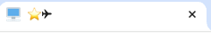
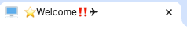

Currently I am developing the 3d portfolio, and to add accent, I wanted to add an animation at browser tab. This is a note how to add animation, with fabulous and funny.

# Title tag
We usually write a page title in a head tag like this.


```html
<head>
  <meta charset="UTF-8" />
  <link rel="icon" type="image/svg+xml" href="/favicon-32x32.png" />
  <meta name="viewport" content="width=device-width, initial-scale=1.0" />
  <title>Page title</title>
</head>
```

So if we want to add animation, we have to change this title tag using JavaScript.

# Code
As for my portfolio page, my animation code is like this.

```JavaScript
const titles = ["⭐️", "W", "e", "l", "c", "o", "m", "e", "‼️", "⭐️"];

let titleIndex = 0;
let cur = '';
setInterval(() => {
  cur = titleIndex == 0 ? "" : cur + titles[titleIndex - 1];
  document.title = cur + "✈︎";
  titleIndex = (titleIndex + 1) % (titles.length + 1);
}, 500);
```

In this code, I changed the title each 500ms. Finally, I could add animation like this.



