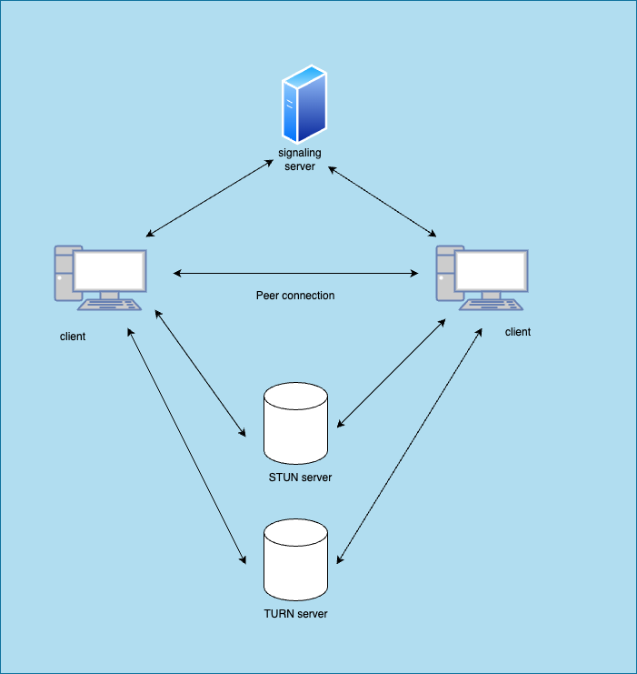

I am studying WebRTC to incorporate it into my shooter game. However, implementing WebRTC without paid services comes with significant challenges. To document and better understand the concepts, I’ve written this summary.

# Overview
This is an overview image of WebRTC.  



### Signaling server
The signaling server is used to exchange connection-related information between clients

### STUN server
This teaches the client's IP address from the perspective of external network.

### TURN server
Actually, if we want to apply the pure P2P connection. This would not be needed. But sometimes this turn server would be needed when the client uses the firewall or NATs. Maintaining this server would be so expensive since this passes the request each other anytime.

### ICE protocol
We can see the using STUN server to pass over the NAT at first, and using TURN server if we cannot connect each other only using STUN server. This ICE protocol determines the methods related to STUN and TURN server.


# How to implement it.
There are many libraries for JavaScript. And PeerJS is one of the most popular one.  

[PeerJS](https://github.com/peers/peerjs)

Surprisingly, this library provides us the free signaling server.  
[PeerJS PeerServer](https://peerjs.com/peerserver)

We also can build own signaling server using PeerServer library.  
[PeerJS-server](https://github.com/peers/peerjs-server)

I think we can use STUN server freely since there are so many services in the internet. But as for TURN server, it would be very difficult since this server passes the correspond each other via itself and prices of networking would be so high. (And this situation is very tough for me since I want to develop my services as much as freely...)

As for TURN server, there are also many libraries to build it. Coturn is one of the famous one.  
[coturn](https://github.com/coturn/coturn)

If want to connect to TURN server using PeerJS, we can set the url and credential info like this.

```JavaScript
const peer = new Peer(undefined, {
  config: {
    iceServers: [
      {
        urls: "turn:turnserver.url.path:80", // Replace with your TURN server URL
        username: "username", // Replace with your TURN username
        credential: "aabbcc", // Replace with your TURN credential
      }
    ]
  }
});
```
[Reference](https://dev.to/alakkadshaw/how-to-use-turn-server-with-peerjs-6eb)
