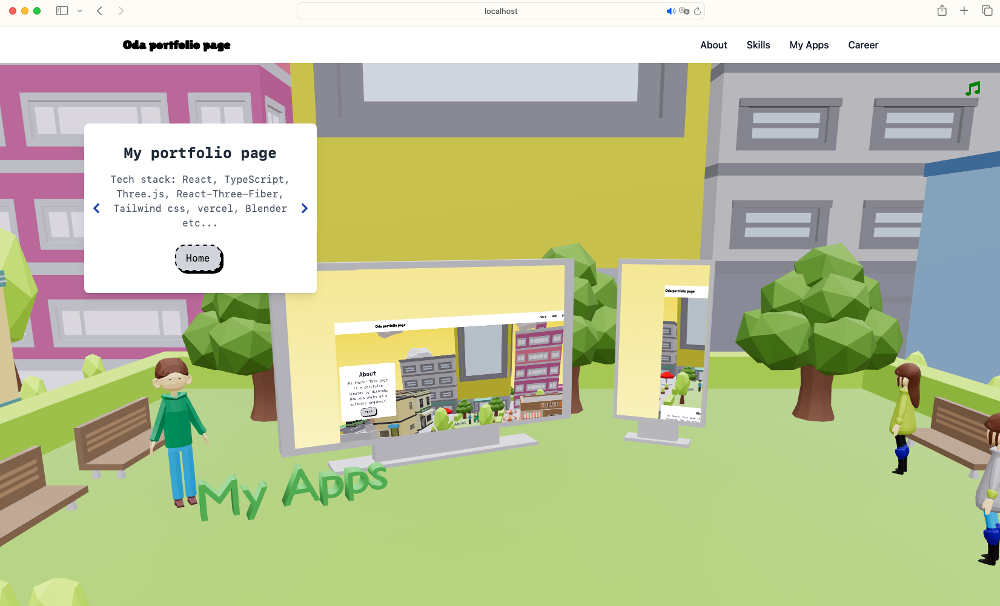
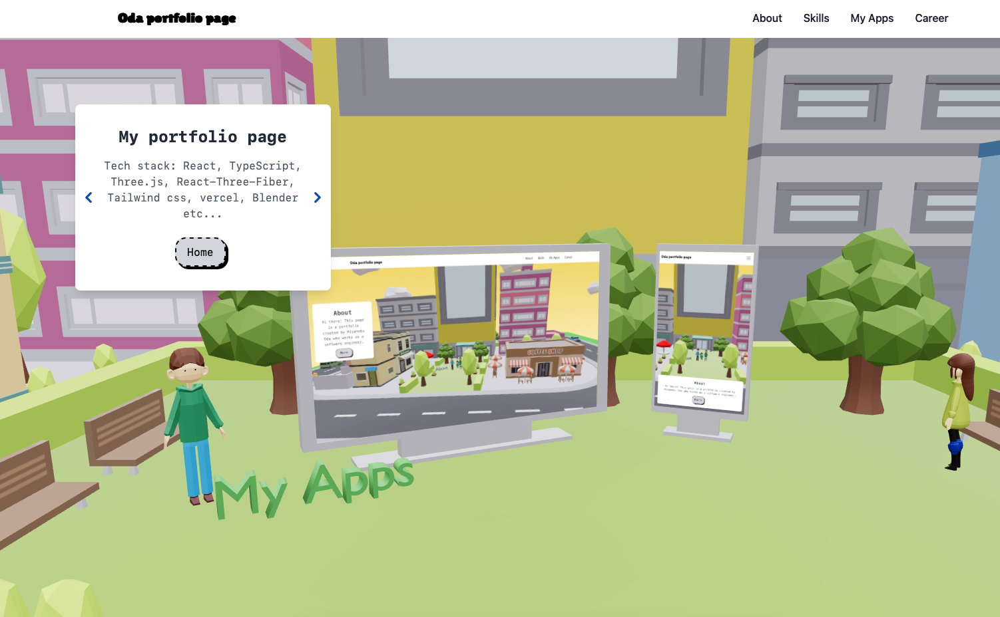

Recently, I developed 3d portfolio to study 3D. But recently I realized the img or iframe I embed was shifted in the specific situation. I want to write notes to handle this problem if I would meet same situation.



# In smartphone
Even if I hadn't met shift situation in PC browser with smartphone width, I met the situation in my iPhone13. Back then I used google chrome, but I also met same problems at other browsers.


# Safari
When I checked safari in PC, I also met same situation as a smartphone.

# the original code with issues
I wrote the previous code like this.

```TypeScript
const SkillsIframe: React.FC<SkillsIframeProps> = ({isZoomed}) => {

  return (
    <Html
      transform
      occlude="blending"
      zIndexRange={[3, 3]} 
      className="w-full h-full max-w-[900px] max-h-[510px] sm:max-w-full sm:max-h-full m-0"
      wrapperClass="htmlScreen"
      distanceFactor={1}
      scale={1}
      position={[ -16.8, 1.3, 21.359]}
      rotation-y={ 80.115 }
      pointerEvents="auto"
    >
      <iframe
        src="/skillPage/skillPage.html"
        className="w-full h-full border-0"
        style={{
          width: '900px',
          height: '510px',
          border: 'none',
          pointerEvents: 'auto',
        }}
      />
    </Html>
  )
}
export default SkillsIframe;
```

# How to handle that
Unfortunately, I haven't been able to find the straight solution. This was related to library's behavior and I faild to fix trying many way like adding some CSS style.

## Alternative solution
To bypass fixing Html component of drei, I used plane geometry with put the texture of img if user uses Safari or smartphone. Unfortunately this isn't perfect since user can't operate with iframe, but I think the screen with shift looks so bad.

# Final code 
The final code is as below.

```TypeScript
const SkillsIframe: React.FC<SkillsIframeProps> = ({isZoomed}) => {

  const [width, setWidth] = useState(window.innerWidth);

  const skillPageTexture = useLoader(TextureLoader, 'the path to png');

  useEffect(() => {
    const handleResize = () => {
      setWidth(window.innerWidth);
    };

    window.addEventListener('resize', handleResize);
    handleResize();
    return () => window.removeEventListener('resize', handleResize);
  }, []);

  if (!isZoomed || width <= 480 || isSafari) {
    return (
      <>
        <mesh 
          position={[ -16.8, 1.3, 21.359]}
          rotation-y={ 80.115 }
        >
          <planeGeometry args={[2.2, 1.25]} />
          <meshBasicMaterial map={skillPageTexture} toneMapped={false} />
        </mesh>
      </>
    )
  }

  return (
  <Html
    transform
    occlude="blending"
    zIndexRange={[3, 3]} 
    className="w-full h-full max-w-[900px] max-h-[510px] sm:max-w-full sm:max-h-full m-0"
    wrapperClass="htmlScreen"
    distanceFactor={1}
    scale={1}
    position={[ -16.8, 1.3, 21.359]}
    rotation-y={ 80.115 }
    pointerEvents="auto"
  >
    <iframe
      src="/skillPage/skillPage.html"
      className="w-full h-full border-0"
      style={{
        width: '900px',
        height: '510px',
        border: 'none',
        pointerEvents: 'auto',
      }}
    />
  </Html>
  )
}

export default SkillsIframe;
```


